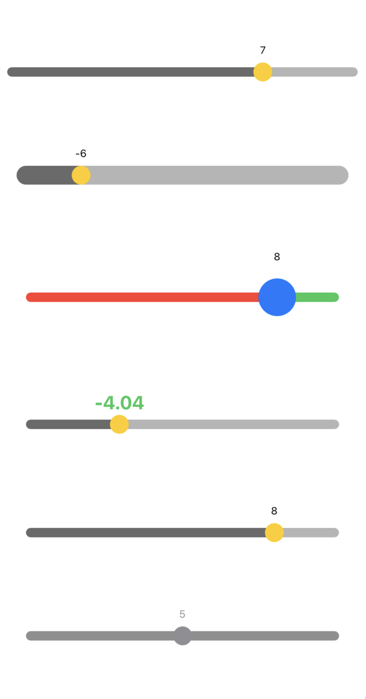
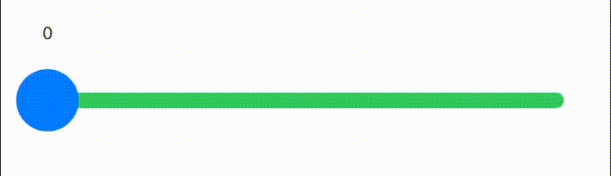
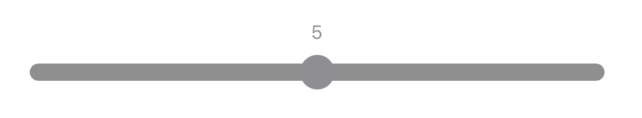

# SwiftUIValueSlider

[](https://travis-ci.org/sanhee16/SwiftUIValueSlider)
[](https://cocoapods.org/pods/SwiftUIValueSlider)
[](https://cocoapods.org/pods/SwiftUIValueSlider)
[](https://cocoapods.org/pods/SwiftUIValueSlider)

This is a Slider created using SwiftUI, which allows you to display the slider's value at the top, and customize the color and size of the thumb and track.

## Example

To run the example project, clone the repo, and run `pod install` from the Example directory first.

## Requirements

iOS 14.0

## Installation

### CocoaPods

SwiftUIValueSlider is available through [CocoaPods](https://cocoapods.org). To install
it, simply add the following line to your Podfile:

```ruby
pod 'SwiftUIValueSlider'
```

### Swift Package Manager

```swift
.package(name: "SwiftUIValueSlider", url: "https://github.com/sanhee16/SwiftUIValueSlider.git", from: "0.1.0")
```

## Guide

 <br/><br/>

<br/>

### Basic

This is a basic ValueSliderView. You can set a closure for when the drag starts, when it's in progress, and when it ends.


```swift
@State var value: Double = 5.0
ValueSliderView($value)
    .sliderFrame(width: gp.size.width - 60.0, height: 10.0)
    .onStart {
        print("on Start: \(value)")
    }
    .onDragging {
        print("on dragging: \(value)")
    }
    .onEnded {
        print("on End: \(value)")
    }
    .frame(width: gp.size.width, alignment: .center)
```

```swift
on Start: 5.6836461126005355
on dragging: 5.6836461126005355
on dragging: 5.674709289387148
on dragging: 5.647899637912617
on dragging: 5.630026809651474
on dragging: 5.621089986438086
on dragging: 5.576407506702412
on End: 5.576407506702412
```

<br/>

### Tracker, Thumb

You can set the height of the slider bar. The height of the bar cannot be greater than the size of the thumb. If you set it larger, it will automatically be set to the size of the thumb.  
You can change the color and size of the thumb, as well as the color of the track.

<br/>

```swift
@State var value: Double = 0.0
ValueSliderView($value)
    .thumb(thumbSize: 40.0, thumbColor: .blue)
    .trackColor(minTrackColor: .red, maxTrackColor: .green)
    .sliderFrame(width: gp.size.width - 60.0, height: 10.0)
    .frame(width: gp.size.width, alignment: .center)
```

<br/>

### Value

You can also set the current value of the slider. If <code>isHidden</code> is set to true, the value will not be displayed.

<br/>

```swift
@State var value: Double = 0.0
ValueSliderView($value)
    .range(sliderRange: -10...10)
    .values(valueFormat: "%.2f", font: .system(size: 20, weight: .bold, design: .default), fontColor: .green, isHidden: false)
    .sliderFrame(width: gp.size.width - 40.0, height: 10.0)
    .frame(width: gp.size.width, alignment: .center)
```

<br/>

```swift
@State var value: Double = 0.0
ValueSliderView($value)
    .values(isHidden: true)
    .sliderFrame(width: gp.size.width - 40.0, height: 10.0)
    .frame(width: gp.size.width, alignment: .center)
```

### Range

You can set a range. The range can include both negative and positive values.

<br/>

```swift
@State var value: Double = 0.0
ValueSliderView($value)
    .range(sliderRange: -10...10)
    .values(valueFormat: "%.2f", font: .system(size: 20, weight: .bold, design: .default), fontColor: .green, isHidden: false)
    .sliderFrame(width: gp.size.width - 40.0, height: 10.0)
    .frame(width: gp.size.width, alignment: .center)
```

<br/>

### Disable

If you set <code>isDisable</code> to true, the slider will not be movable and its color will change to gray.

<br/>

```swift
@State var value: Double = 5.0
ValueSliderView($value)
    .isDisable(true)
    .sliderFrame(width: gp.size.width - 40.0, height: 10.0)
    .frame(width: gp.size.width, alignment: .center)
```


## Author

sanhee16, sinhioa20@gmail.com

## License

SwiftUIValueSlider is available under the MIT license. See the LICENSE file for more info.
